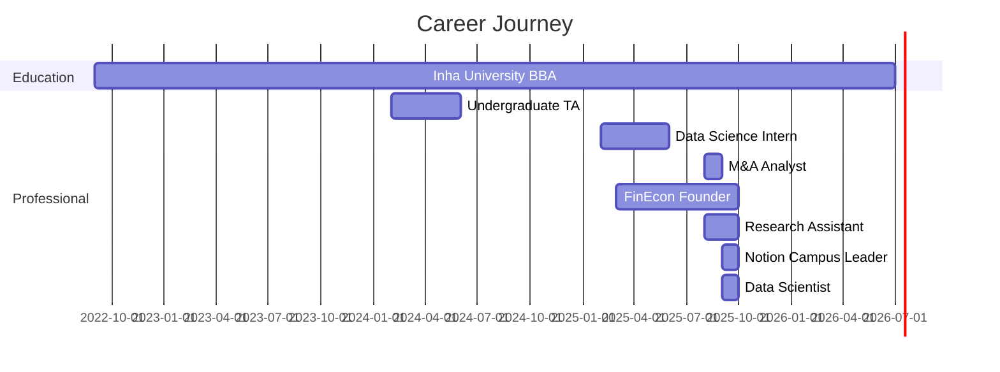

# Hi there, I'm Diyorbek Zokirov 👋

<div align="center">
  
[](https://git.io/typing-svg)

</div>

<div align="center">
  
  [](https://www.linkedin.com/in/diyorbek-zokirov-777har)
  [](mailto:diyorbekinvestormit@gmail.com)
  [](#)
  
</div>

---

## 🚀 About Me

```python

class DataScientist:
    def __init__(self):
        self.name = "Diyorbek Zokirov"
        self.role = "Data Scientist @ HumbleBee.ai"
        self.location = "Seoul Incheon Metropolitan Area 🇰🇷"
        self.education = "BBA, International Business and Trade @ Inha University"
        self.languages = ["Uzbek", "English", "Russian", "Korean"]
        self.interests = ["Machine Learning", "Finance", "Data Analysis"]
        
    def current_focus(self):
        return [
            "Building AI solutions at HumbleBee.ai",
            "Research at UT Dallas",
            "Growing FinEcon community",
            "Notion Campus Leadership"
        ]
    
    def say_hi(self):
        print("Thanks for visiting! Let's connect and build something amazing together!")

me = DataScientist()
me.say_hi()
```

---

## 💼 Current Roles

| 🐝 **HumbleBee AI** | 🎯 **Notion Campus Leader** |
|:---|:---|
| **Data Scientist** | **Community Leader** |
| *Sept 2025 - Present* | *Sept 2025 - Present* |
| Building cutting-edge AI solutions | Leading Notion community initiatives |

| 🔬 **UT Dallas** | 💡 **FinEcon** |
|:---|:---|
| **Research Assistant** | **Founder** |
| *Aug 2025 - Present* | *March 2025 - Present* |
| Working with Prof. Botir Kobilov | Building financial education platform |

---

## 🛠️ Tech Stack

### Languages
<p align="left">
  
  
  
  
</p>

### Data Science & ML
<p align="left">
  
  
  
  
  
  
</p>

### Data Visualization
<p align="left">
  
  
  
  
</p>

### Databases & Tools
<p align="left">
  
  
  
  
  
</p>

### Cloud & Deployment
<p align="left">
  
  
  
</p>

### Productivity & Collaboration
<p align="left">
  
  
  
</p>

---

## 📊 GitHub Stats

<div align="center">
  
  
  

</div>

<div align="center">
  
  [](https://git.io/streak-stats)
  
</div>

## 📈 Experience Timeline




---

## 💡 Recent Blog Posts

<!-- BLOG-POST-LIST:START -->
- Coming soon!
<!-- BLOG-POST-LIST:END -->

---

## 🤝 Let's Connect!

<div align="center">

I'm always interested in collaborating on exciting data science and machine learning projects!  
Feel free to reach out if you want to:

💬 Discuss ML/AI projects  
🤝 Collaborate on open source  
📊 Talk about finance and data  
☕ Just chat about tech!

</div>

---

<div align="center">
  
### 📊 Profile Views
  


### ⭐ Show some love by starring some repositories!

</div>

---

<div align="center">
  
</div>
